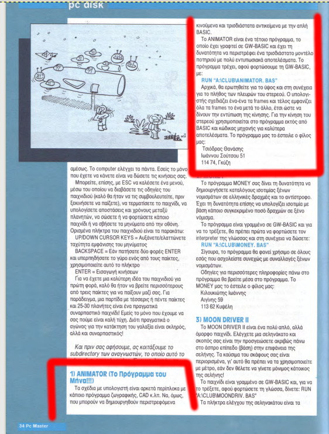
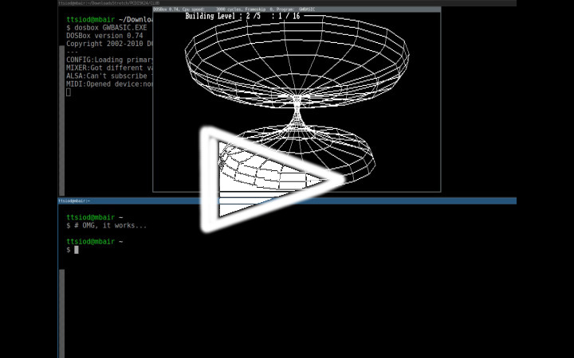

The Program of the Month *(July 2017)*

## The good old days

Two weeks ago, we are sitting in the coffee corner with my good friends Maxime and Marcel.
We are enjoying the rare phenomenon of sunshine in the Netherlands, and reminisce about
our geeky childhoods...

Marcel recounts his TRS-80 and ATARI ST exploits; and the rockets he launched!

Maxime describes <a href="https://en.wikipedia.org/wiki/Minitel" target="_blank">Minitel</a>
and PC speaker music; his BBS; and watching PC demos while listening to his
<a href="https://en.wikipedia.org/wiki/Gravis_Ultrasound" target="_blank">Gravis Ultrasound</a>.

I rant about <a href="http://en.wikipedia.org/wiki/ZX_Spectrum#ZX_Spectrum_16K.2F48K"
target="_blank">ZX Spectrum</a> and my *(bordering on insanity)* obsession on the Z80
and the Speccy's ROM. Then, after entering the Uni, my switch to the world of 8086... 
I describe the agonizing process of connecting to the *(so few, at the
time!)* university modems - from where the treasures of the demoscene could be
obtained at top speed, via `sz`. And share the shocking experience of my first
sound card - listening late into the night to
<a href="https://www.youtube.com/watch?v=9qFQBcsUOWc&index=7&list=RDDmhtc5S4atU"
target="_blank">Purple Motion and Skaven</a>, while watching Future Crew's Unreal - again
and again...

Ah, those were the days.

And then I remember my first "publication". I tell my friends about how
a Greek PC magazine at the time *(26 years ago!)* accepted a GW BASIC hack 
I did as the *"Program of the Month"*; and bundled it on the cover 5 1/4 floppy
disk.

But - I have no proof of that anymore! That code is forever lost...

"Perhaps not", says Maxime.

Many French magazines of that era have been scanned nowadays; "Have you searched?
Maybe the same has happened to your magazine as well..."

## Could it be?

I return home, boot up my Arch Linux and search for *"PC Master pdf"* - asking
Google for pages with Greek results only.

What!

Some people have indeed scanned <a href="http://www.iamretro.gr/pc-master/"
target="_blank">all 150 first issues of the magazine</a>, with the official blessing
of the company that published it behind them!...

Oh God. 

I register on the site... but what should I download? There are no covers here,
and I don't remember the issue number!

I can easily write a one-liner to download all 150 of those .rar files,
but that would be rude; these people gave me a gift, I am not going to abuse it.

I search again for "εξώφυλλα" (covers) of PC Master... and Google obliges:

 
There! Some other kind soul has scanned many of the magazine's covers - and amongst
many missing issues, the one with the big-headed Alien makes my subconscious scream -

&nbsp;&nbsp;&nbsp;&nbsp;&nbsp; *"That's it!"*

PC Master, issue 24, November 1991.

## Oh God, oh God...

Downloading that .rar file...

And there, there it is - they have uploaded the bundled diskette code!

    $ rar l PCMaster024.rar 
    
    RAR 4.20   Copyright (c) 1993-2012 Alexander Roshal   9 Jun 2012
    Trial version             Type RAR -? for help
    
    Archive PCMaster024.rar
    
     Name             Size   Packed Ratio  Date   Time     Attr      CRC   Meth Ver
    -------------------------------------------------------------------------------
     BAT2EXEC.COM     6272     4727  75% 07-10-90 01:23  .....A.   83BD5529 m3g 2.9
     BC.EXE           7628     7473  97% 08-02-91 15:31  .....A.   B8003477 m3g 2.9
     BIGECHO.COM       461      373  80% 12-09-86 13:31  .....A.   70572480 m3g 2.9
     ANIMATOR.BAS     3852     2031  52% 23-07-91 11:07  .....A.   C3D9E567 m3g 2.9
     ANIMATOR.DOC     3843     1984  51% 15-09-91 19:23  .....A.   E83E02E9 m3g 2.9
     CLUB.DOC         1729      782  45% 20-10-91 15:52  .....A.   8E72AEB8 m3g 2.9
     MONEY.BAS       11155     3773  33% 13-10-91 17:54  .....A.   BB656E00 m3g 2.9
     MONEY.TXT        1792      599  33% 14-10-91 00:43  .....A.   D180E3AF m3g 2.9
     MOONDRIV.BAS     5884     3585  60% 13-06-11 04:27  .....A.   471A3A53 m3g 2.9
     MOONDRIV.DOC     1494      786  52% 13-06-11 04:38  .....A.   8D83AE1B m3g 2.9
     OROSKOPO.BAS     6753     1486  22% 01-01-80 00:08  .....A.   5BEF4387 m3g 2.9
     OROSKOPO.DOC      768      504  65% 01-01-80 00:31  .....A.   EA70E5EF m3g 2.9
     DBLCROSS.EXE    58783    50213  85% 22-04-91 21:56  .....A.   9182B646 m3g 2.9
     DISTYPE.COM       188      172  91% 02-10-87 21:10  .....A.   1B4421AB m3g 2.9
     DRAFT.LQC        2108      851  40% 27-06-88 15:06  .....A.   40884C75 m3g 2.9
     GALACTIC.EXE    51991    47636  91% 08-06-87 03:12  .....A.   CD8F048B m3g 2.9
     LETTER.LQC       5774     2011  34% 27-06-88 15:05  .....A.   F7DA02FC m3g 2.9
     LHX.EXE         14854    14371  96% 15-04-89 17:14  .....A.   3D73AE27 m3g 2.9
     LQCHAR.COM       6375     4016  62% 03-07-88 12:51  .....A.   AB214EA5 m3g 2.9
     PCDISK24.TXT    20386     8989  44% 14-10-97 21:12  .....A.   0FA26420 m3g 2.9
     PCMASTER.MNU     1959      417  21% 19-10-91 18:42  .....A.   270A45BA m3g 2.9
     PCMASTER.24      7335     3105  42% 20-10-91 15:31  .....A.   74BC3CA5 m3g 2.9
     SIMCGA.COM       7103     4327  60% 15-10-87 02:02  .....A.   B06D0F1F m3g 2.9
     SOL2.CHR        12915     7149  55% 09-04-91 21:19  .....A.   3EE336AC m3g 2.9
     START.BAT         937      436  46% 17-10-91 01:04  .....A.   A51294EA m3g 2.9
     TINY.CHR         8188     4082  49% 09-04-91 14:54  .....A.   2C397815 m3g 2.9
     VIRSTOP.EXE     24279    22233  91% 17-11-89 09:36  .....A.   72732759 m3g 2.9
     pcmaster024.pdf 25551893 25365818  99% 08-04-13 18:59  .....A.   961392CA m3g 2.9
     CLUB                0        0   0% 27-07-13 21:42  .D.....   00000000 m0  2.0
     README              0        0   0% 27-07-13 21:42  .D.....   00000000 m0  2.0
     PCDISK24            0        0   0% 27-07-13 21:42  .D.....   00000000 m0  2.0
    -------------------------------------------------------------------------------
       31         25826699 25563929  98%

That `ANIMATOR.BAS` is **mine**!

My own.

My... precious!

...

I open the .pdf - and sure enough, there it is; *"Eternal Glory"* :-)

 
I have to - no, *I need* to run this!

<a href="https://www.dosbox.com/" target="_blank">DOSBOX!</a> Now, now, now!

...

Oh wait - I also need GWBASIC...

Google, give me GW BASIC!

...

Will it work?

DOSBOX doesn't render Greek DOS codepages by default *(of course not! what was it?
something about `codepage prepare`?)*

Nah, never mind - I can't be bothered to hunt that down right now!

Run! Run! Run!

<a href="https://www.youtube.com/watch?v=9u2AIiLwMns">
Youtube video</img></a>

<em>Ecstasy. Bliss. Heaven.</em>

There's something in my eye.

Look away... :-)
