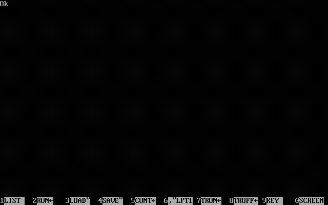
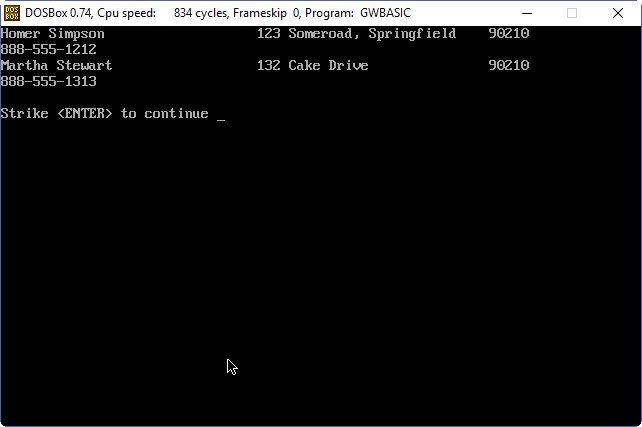
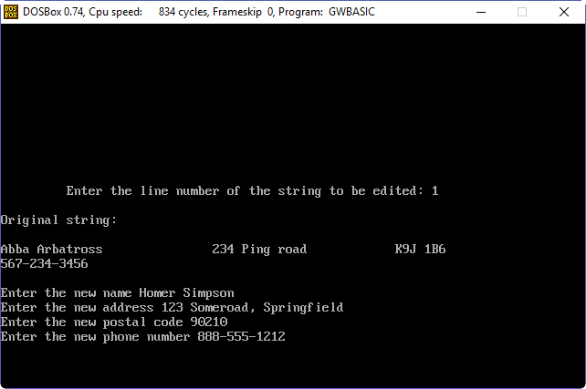
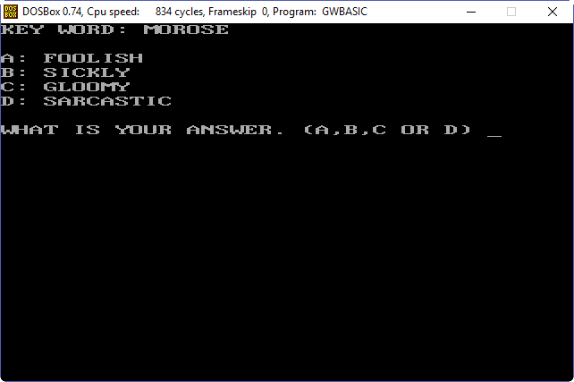

# Classic GWBASIC

This repo contains an archive of some of the first code that I wrote, or played around with, using GWBASIC when I was a kid.  

It was fun to take a trip down memory lane and fire up this old code roughly 30 years after writing it.

For running this old code, I found that using  DOSBOX worked well, allowing the original GWBASIC.exe to run in Windows 10.

DOSBOX also allows you to throttle the CPU cycles down, so that the original run speed and timing are similar to the original.  I think the DOSBOX default is 3,000 cycles and I found that for this code, using around 800 cycles seemed to be a decent imitation of the original timing (which can be seen in the Lingoaid Splash Screen gif below).

You can find DOSBOX here: [http://www.dosbox.com/download.php?main=1](http://www.dosbox.com/download.php?main=1) 

## LingoAid

The flagship product (where did we get that name?) was an Address List application that myself and a friend Jeff wrote when we were teenagers.  It was my first real application with a purpose.  Our client was my next door neighbour who ran the church address list.  Prior to using our application, they managed the list using a typewriter.  When members of the parish would move, they would have to use liquid paper to white out their name/address line and then recopy the list.

Our silly little software was amazing to them.  When someone had to be removed, or inserted, simply update the records that were stored in a flat file, sort it alphabetically and then print it out.  They loved it.

Our splash screen highlighted the grandeur of teenagers building something with our fake company T.J. Software.

## Word Game

A simple little word game that would present the player with a word and they would have to guess the correct definition from four multiple choice options.  (Only 10 questions implemented though, LOL)

## Slots
Slots is a text based slots type game.  You hit enter to spin and you either win or lose.

## The Rest

The rest of the files I think are testing files that were used to run and test individual parts of functionality and eventually got copied into Lingoaid.
